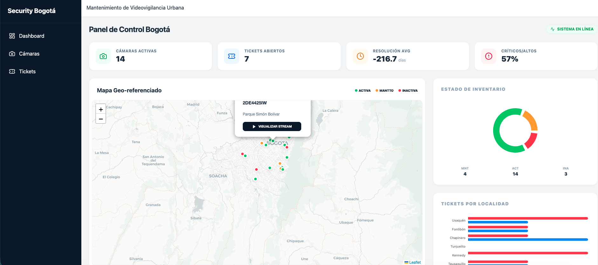
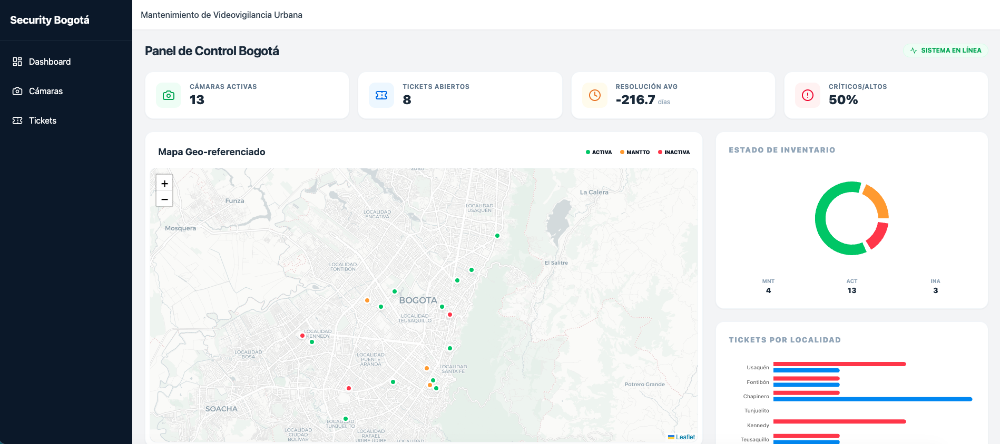
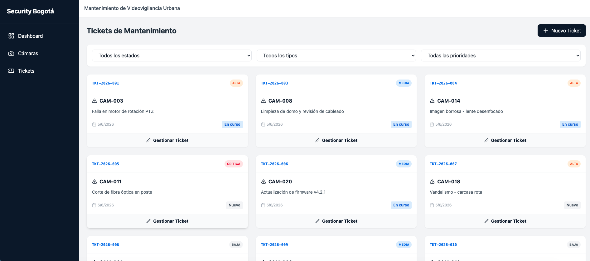
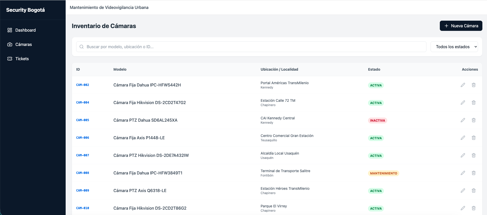
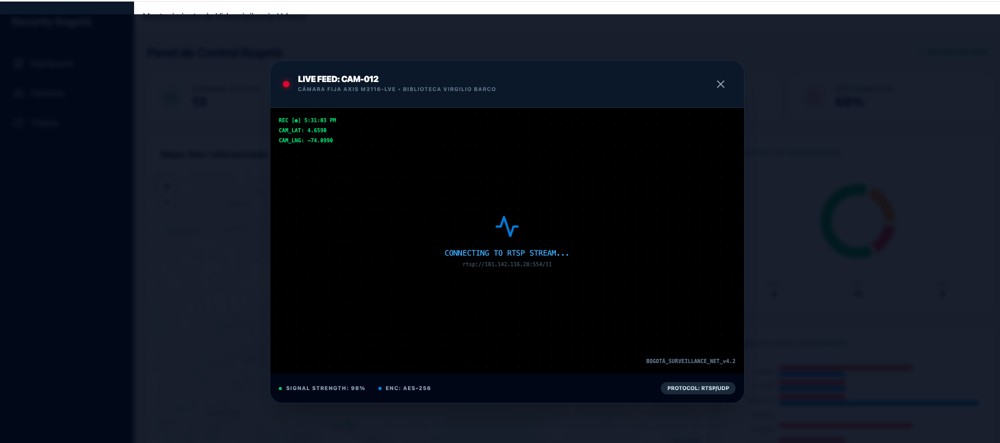

# Sistema de Videovigilancia Bogotá - Grupo Verytel

Este proyecto es una prueba técnica para la gestión de cámaras de seguridad y tickets de mantenimiento en la ciudad de Bogotá.

## Características
- **Dashboard Interactivo:** KPIs, gráficas de distribución de estado y tickets por localidad.
- **Mapa en Tiempo Real:** Visualización geolocalizada de cámaras con estados diferenciados por colores.
- **Gestión de Cámaras:** CRUD completo con validaciones geográficas y soft delete.
- **Gestión de Tickets:** Seguimiento de mantenimiento con flujo de estados controlado.

## Requisitos
- Docker y Docker Compose

## Visualización
### Panel de Control y Mapa



### Gestión de Inventario



### Live Stream HUD 


## Ejecución Rápida
1. Clonar el repositorio.
2. Ejecutar:
   ```bash
   docker-compose up --build
   ```
3. El sistema estará disponible en:
   - **Frontend:** http://localhost:3000
   - **Backend API:** http://localhost:8000/api/v1
   - **Documentación API (Swagger):** http://localhost:8000/docs

## Comandos Útiles (Docker)
Estos scripts facilitan las tareas comunes. Ejecútalos desde la raíz del proyecto (requieren que los contenedores estén corriendo):

- **Reiniciar Base de Datos:** Limpia todos los datos y vuelve a ejecutar el seed.
  ```bash
  ./reset_db.sh
  ```
- **Ejecutar Pruebas:** Corre los tests unitarios del backend.
  ```bash
  ./run_tests.sh
  ```

## Carga de Datos Iniciales (Manual)
El sistema incluye un script de semilla. Si prefieres ejecutarlo manualmente con Docker:
```bash
docker-compose exec backend python seed.py
```

## Ejecución Manual (Sin Docker)
### Backend
1. Ir a `backend/`.
2. Crear un entorno virtual e instalar dependencias: `pip install -r requirements.txt`.
3. Ejecutar migraciones: `python manage.py migrate`.
4. Cargar datos: `python seed.py`.
5. Ejecutar: `python manage.py runserver`.
6. (Opcional) Ejecutar pruebas: `python manage.py test cameras_api`.

### Frontend
1. Ir a `frontend/`.
2. Instalar dependencias: `npm install`.
3. Ejecutar: `npm run dev`.

## Pruebas (Manual)
Para ejecutar las pruebas del backend sin Docker:
```bash
cd backend
python manage.py test cameras_api
```
